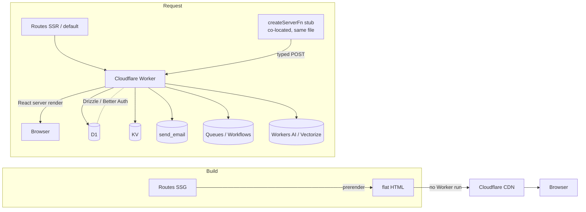

# TanStack Start on Cloudflare

Conventions for full-stack TypeScript apps on Bun + TanStack Start, running entirely on Cloudflare. Source of truth for stack choices, layout, integrations, and deploy. Deviate only with explicit reason.

**Everything is a Cloudflare binding.** No external database, no external mail provider, no separate API server. One Worker, one `wrangler deploy`.

## Stack

| Layer        | Choice                                          |
| ------------ | ----------------------------------------------- |
| Dev runtime  | Bun (package manager, scripts)                  |
| Prod runtime | Cloudflare Workers (V8 isolate)                 |
| Language     | TypeScript (strict)                             |
| Framework    | TanStack Start (React 19 + TanStack Router)     |
| Build        | Vite + `@cloudflare/vite-plugin`                |
| API          | Server functions + route `server.handlers`      |
| ORM          | Drizzle + Drizzle Kit                           |
| Database     | Cloudflare D1 (SQLite)                          |
| KV           | Cloudflare KV (session cache, auth rate limits) |
| Auth         | Better Auth                                     |
| Email        | Cloudflare Email Sending (`send_email` binding) |
| CSS          | Tailwind v4 (`@tailwindcss/vite`)               |
| UI           | shadcn/ui (Radix + Tailwind) + lucide-react     |
| Forms        | TanStack Form                                   |
| Validation   | Zod                                             |
| Logs         | Workers Observability (`console` + Workers Logs, `wrangler tail`)|
| Test         | Vitest + `@cloudflare/vitest-pool-workers`      |
| Deploy       | `bunx wrangler deploy`                          |

### Non-negotiables

- Bun is the dev runtime: package manager and script runner. Never `npm` / `pnpm` / `yarn` / `node`. (Tests run in workerd via Vitest, not in Bun.)
- Production runs on **Cloudflare Workers** — a V8 isolate, not Node. Runtime code uses Web-standard APIs (`fetch`, Web Crypto, Streams).
- No Bun-specific APIs (`Bun.password`, `bun:sqlite`, `Bun.s3`) in runtime code — it never executes under Bun. Dev, test, and prod all run on workerd.
- **Bindings are request-time.** Build the DB client and Better Auth inside the handler, never at module top level. Module-level binding reads are unsafe because the Vite-plugin's async context isn't established at import time; you'd read stale/empty env and silently corrupt state.
- TypeScript `strict: true` everywhere.
- Do not install: `dotenv`, `ts-node`, `tsx`, `nodemon`, `jest`, `bcrypt`, `argon2`, `node-fetch`, `nodemailer`, `winston`, `bunyan`, `pino`, `hono`, `express`.
- **Version policy**: TanStack Start tracks one major behind current when a previous major exists. Today only `1.x` has ever shipped, so pin `"@tanstack/react-start": "^1.168"` in `package.json` and bump deliberately.
- Vitest is the test runner, always through `@cloudflare/vitest-pool-workers` so tests get real bindings. Not `bun test`, not `jest`.

### Deliberately unconfigured

No formatter/linter, no git hooks, no CI pipeline — deferred, not rejected. Nothing in this skill depends on them, so adding them later is additive. When that day comes: Biome for lint/format, lefthook for hooks, GitHub Actions running `bunx tsc --noEmit` + `bunx vitest run` + `bunx wrangler deploy`.

### Add only when the need is real

Everything below is **not** in the default stack. Add one when the listed condition is actually hit, not in anticipation.

| Need                                                       | Add                                                    |
| ---------------------------------------------------------- | ------------------------------------------------------ |
| Relational workload D1 can't hold (>10 GB, Postgres-only SQL) | PostgreSQL via Hyperdrive + `postgres` driver + `drizzle-orm/postgres-js` |
| Semantic search, RAG, similarity over text                  | Workers AI (embeddings) + **Vectorize** binding (native vector store on Workers) |
| Append-only time-series analytics (signups, feature-flag hits, email opens) | **Workers Analytics Engine** binding (SQL-queryable, no extra infra) |
| Long-running or multi-step background jobs (cleanup, digests, reports) | Cloudflare **Queues** (consumers) / **Workflows** (durable, retryable, step-based) |
| Scheduled jobs (cleanup, digests, reports)                 | Cron Triggers in `wrangler.toml`                       |
| Realtime / WebSocket app (presence, collaboration)         | Durable Object with **WebSocket Hibernation**           |
| Strong consistency, atomic counters, single-writer state   | Durable Object                                         |
| Headless Chrome (PDF/screenshot, scraping)                 | Workers **Browser Rendering** binding (open beta)       |
| Long-lived non-V8 task (ffmpeg, heavy CPU, GPU)            | Cloudflare **Containers** (open beta)                   |
| User uploads / large media                                 | R2 binding — serve via a route handler, no S3 SDK       |
| AI features (chat, classification, embeddings)              | Workers AI binding — no external API key               |
| Rate limits on non-auth routes                             | Cloudflare `ratelimits` binding                        |
| Bot protection on signup / public forms                    | Cloudflare Turnstile — free, no CAPTCHA friction       |
| Admin panel auth / internal tooling                        | Cloudflare Access (Zero Trust) — no custom auth code    |
| Centralized secret governance across Workers               | **Cloudflare Secrets Store** binding (vs ad-hoc `wrangler secret put`) |
| Private network path to on-prem DB                         | Workers **VPC** binding (open beta)                     |
| Marketing email, templates, campaign analytics             | Resend + React Email (transactional stays on the binding) |
| Error alerting / release tracking beyond Workers Logs      | `@sentry/cloudflare` + `@sentry/tanstackstart-react`   |
| Standalone API with many middleware layers or OpenAPI      | Hono, mounted at `src/routes/api/$.ts`                 |
| Second language                                            | i18n lib of choice — do not hand-roll                  |

## Architecture



- CRUD → **server functions** co-located with components.
- Webhooks, files, anything non-React → **route `server.handlers`** (`src/routes/api/*.ts`).
- **Better Auth** mounts as a route handler and uses Drizzle over D1.
- One **Zod schema** per concept in `src/schemas/`, shared by server fn / Form / validation.
- Secrets come from **Worker bindings**, never `process.env`. Public values use the `VITE_` prefix.

### Rendering strategy

| Route type                              | Mode         | How                                                                 |
| --------------------------------------- | ------------ | ------------------------------------------------------------------- |
| Data-independent (landing, blog, about) | Static (SSG) | `tanstackStart({ prerender: { enabled: true } })` in `vite.config.ts` |
| Per-request data (dashboard, account)   | Server (SSR) | default                                                             |
| Purely client-rendered                  | CSR          | `ssr: false` route option in `createFileRoute(...)({ ... })`        |

Prerendered routes serve flat HTML from the CDN with no Worker invocation — use them for everything that doesn't read per-user data.

## Project structure

```
src/
├── routes/
│   ├── __root.tsx
│   ├── index.tsx
│   └── api/auth/$.ts             # Better Auth handler
├── db/
│   ├── index.ts                  # Drizzle client (from D1 binding)
│   ├── schema.ts                 # business tables
│   └── auth-schema.ts            # Better Auth (CLI-generated, do not edit)
├── lib/
│   ├── auth.ts, auth-client.ts
│   └── email.ts                  # send_email binding wrapper
├── schemas/                      # shared Zod schemas
├── components/{ui,forms}/
├── styles/app.css                # @import "tailwindcss"
├── start.ts                      # global request middleware (security headers)
└── router.tsx
drizzle/                          # generated migrations (= wrangler migrations_dir)
drizzle.config.ts, vite.config.ts, vitest.config.ts, wrangler.toml
```

## Setup

### Scaffold

```bash
# Official TanStack CLI — pick Bun as package manager when prompted.
# `bun create tsrouter-app@latest my-app` still works as a legacy alias.
bunx @tanstack/cli@latest create my-app && cd my-app
```

### Install

```bash
# Runtime
bun add drizzle-orm better-auth zod @tanstack/react-form tailwindcss @tailwindcss/vite

# Dev
bun add -d drizzle-kit wrangler @cloudflare/vite-plugin @vitejs/plugin-react
bun add -d vitest @cloudflare/vitest-pool-workers

# UI
bunx shadcn@latest init
```

### Provision Cloudflare resources

Each command prints an id for `wrangler.toml`.

```bash
bunx wrangler d1 create my-app
bunx wrangler kv namespace create KV
bunx wrangler email sending enable example.com   # onboard the sending domain (must be on Cloudflare DNS)
```

### Auth schema & migrations

```bash
# After writing src/lib/auth.ts
bunx @better-auth/cli generate --output src/db/auth-schema.ts

# Migrations: generate SQL with Drizzle, apply with wrangler.
# Point wrangler migrations_dir at ./drizzle so the two agree — otherwise
# wrangler won't find the SQL drizzle-kit generated.
bunx drizzle-kit generate
bunx wrangler d1 migrations apply my-app --local     # dev
bunx wrangler d1 migrations apply my-app --remote    # prod
```

### Regenerate Env types

```bash
# Re-run after every wrangler.toml edit so env.* bindings are typed.
bunx wrangler types
```

## Integration patterns

### Drizzle over D1

D1 is a binding, not a connection string — no pool, no driver, no `DATABASE_URL`. Read the binding inside the request.

```ts
// src/db/index.ts
import { drizzle } from 'drizzle-orm/d1'
import { env } from 'cloudflare:workers'
import * as schema from './schema'
import * as authSchema from './auth-schema'

// Call inside a handler. Bindings are request-scoped — never at module top level.
export const getDb = () => drizzle(env.DB, { schema: { ...schema, ...authSchema } })
export type DB = ReturnType<typeof getDb>
```

```ts
// src/db/schema.ts — SQLite tables, not pg
import { integer, sqliteTable, text } from 'drizzle-orm/sqlite-core'

export const posts = sqliteTable('posts', {
  id: text('id').primaryKey(),
  title: text('title').notNull(),
  body: text('body').notNull(),
  createdAt: integer('created_at', { mode: 'timestamp' }).notNull(),
})
```

```ts
// drizzle.config.ts
import { defineConfig } from 'drizzle-kit'

export default defineConfig({
  schema: ['./src/db/schema.ts', './src/db/auth-schema.ts'],
  out: './drizzle',
  dialect: 'sqlite',
  // `generate` only emits SQL — no connection needed.
  // drizzle-kit studio against remote D1 additionally needs driver: 'd1-http' + dbCredentials.
})
```

Workflow: `drizzle-kit generate` writes SQL into `drizzle/`; `wrangler d1 migrations apply` runs it. Never `drizzle-kit migrate` — it has no D1 binding (it expects a live connection string, which D1 doesn't expose).

#### If you outgrow D1 and switch to Postgres

Postgres on Workers **must** go through Hyperdrive — an isolate can't hold a long-lived TCP connection across requests, and Hyperdrive pools them at the edge. Four things change together:

```ts
// src/db/index.ts
import { drizzle } from 'drizzle-orm/postgres-js'
import postgres from 'postgres'
import { env } from 'cloudflare:workers'
import * as schema from './schema'

export const getDb = () =>
  drizzle(postgres(env.HYPERDRIVE.connectionString, { prepare: false, max: 5 }), { schema })
```

1. `bunx wrangler hyperdrive create my-app-db --connection-string="postgres://..."`, then a `[[hyperdrive]]` block in `wrangler.toml` (drop `[[d1_databases]]`).
2. Schema moves from `drizzle-orm/sqlite-core` to `pg-core`; Better Auth adapter goes `provider: 'sqlite'` → `'pg'`.
3. Keep `nodejs_compat` — postgres.js needs the Node `net` polyfill.
4. Migrations connect **directly** to Postgres via `DATABASE_URL` (`drizzle-kit migrate`), not through Hyperdrive and not via `wrangler d1 migrations apply`. Hyperdrive is not a migration endpoint.

For routes with several DB round trips, consider Smart Placement so the Worker runs closer to the database — but not on asset-heavy Workers.

### Better Auth

Better Auth needs the DB, so it is request-scoped too.

```ts
// src/lib/auth.ts
import { betterAuth } from 'better-auth'
import { drizzleAdapter } from 'better-auth/adapters/drizzle'
import { tanstackStartCookies } from 'better-auth/tanstack-start'
import { env } from 'cloudflare:workers'
import { getDb } from '~/db'
import { sendEmail } from '~/lib/email'

export function getAuth() {
  return betterAuth({
    database: drizzleAdapter(getDb(), { provider: 'sqlite' }),
    // KV keeps session reads off D1's single-region write primary.
    secondaryStorage: {
      get: (key) => env.KV.get(key),
      set: (key, value, ttl) => env.KV.put(key, value, ttl ? { expirationTtl: ttl } : undefined),
      delete: (key) => env.KV.delete(key),
    },
    // Built-in limiter — do not hand-roll one
    rateLimit: {
      enabled: true,
      storage: 'secondary-storage',
      customRules: { '/sign-in/email': { window: 60, max: 5 } },
    },
    secret: env.BETTER_AUTH_SECRET,
    baseURL: env.PUBLIC_ORIGIN,
    emailAndPassword: {
      enabled: true,
      requireEmailVerification: true,
      sendResetPassword: ({ user, url }) =>
        sendEmail(user.email, 'Reset your password', `<a href="${url}">Reset your password</a>`),
    },
    emailVerification: {
      sendVerificationEmail: ({ user, url }) =>
        sendEmail(user.email, 'Verify your email', `<a href="${url}">Verify your email</a>`),
    },
    socialProviders: {
      google: { clientId: env.GOOGLE_CLIENT_ID, clientSecret: env.GOOGLE_CLIENT_SECRET },
      github: { clientId: env.GITHUB_CLIENT_ID, clientSecret: env.GITHUB_CLIENT_SECRET },
    },
    // tanstackStartCookies must be the LAST plugin in the array.
    plugins: [tanstackStartCookies()],
  })
}
```

```ts
// src/routes/api/auth/$.ts
import { createFileRoute } from '@tanstack/react-router'
import { getAuth } from '~/lib/auth'

const handler = ({ request }: { request: Request }) => getAuth().handler(request)

export const Route = createFileRoute('/api/auth/$')({
  server: { handlers: { GET: handler, POST: handler } },
})
```

```ts
// src/lib/auth-client.ts
import { createAuthClient } from 'better-auth/react'
export const authClient = createAuthClient()
export const { signIn, signOut, signUp, useSession } = authClient
```

Server-side session, inside a `createServerFn` handler or route `beforeLoad`:

```ts
// inside a server fn / beforeLoad
import { getRequestHeaders } from '@tanstack/react-start/server'
const session = await getAuth().api.getSession({ headers: getRequestHeaders() })
```

Providers beyond the built-ins:

- **Phone OTP** → `phoneNumber` plugin from `better-auth/plugins`; supply `sendOTP` (SMS provider is yours).
- **WeChat** → `genericOAuth` plugin from `better-auth/plugins`; WeChat is not a built-in provider.

Re-run `bunx @better-auth/cli generate` + `bunx drizzle-kit generate` after every Better Auth or plugin change — plugins add tables.

### Email (Cloudflare Email Sending)

No API key, no SDK — the `send_email` binding is the whole integration.

```ts
// src/lib/email.ts
import { env } from 'cloudflare:workers'

export async function sendEmail(to: string, subject: string, html: string) {
  await env.EMAIL.send({
    to,
    from: { email: env.EMAIL_FROM, name: env.APP_NAME },
    subject,
    html,
    text: html.replace(/<[^>]+>/g, ' ').trim(), // clients that only show plain text
  })
}
```

The `from` domain must be onboarded first (`bunx wrangler email sending enable example.com`) and on Cloudflare DNS — otherwise the verification/reset flow fails silently. Transactional only — marketing sends belong on a marketing platform.

### R2 (not in the base stack)

Add it when there are actual uploads — `bunx wrangler r2 bucket create my-app`, then:

```toml
# wrangler.toml
[[r2_buckets]]
binding = "R2"
bucket_name = "my-app"
```

It's a binding like the rest — serve through a route handler, never add an S3 SDK:

```ts
// src/routes/api/files/$key.ts
import { createFileRoute } from '@tanstack/react-router'
import { env } from 'cloudflare:workers'

export const Route = createFileRoute('/api/files/$key')({
  server: {
    handlers: {
      GET: async ({ params }) => {
        const obj = await env.R2.get(params.key)
        if (!obj) return new Response('Not found', { status: 404 })
        return new Response(obj.body, {
          headers: { 'content-type': obj.httpMetadata?.contentType ?? 'application/octet-stream' },
        })
      },
    },
  },
})
```

Authorize writes **before** calling `env.R2.put()` — the route handler is the trust boundary, not R2. For large or direct-from-browser uploads, put the bucket behind a custom domain or issue presigned URLs instead of streaming through the Worker.

```ts
// src/routes/api/files/upload.ts — authorized PUT
import { createFileRoute } from '@tanstack/react-router'
import { env } from 'cloudflare:workers'
import { getAuth } from '~/lib/auth'
import { getRequestHeaders } from '@tanstack/react-start/server'

export const Route = createFileRoute('/api/files/upload')({
  server: {
    handlers: {
      PUT: async ({ request }) => {
        const session = await getAuth().api.getSession({ headers: getRequestHeaders() })
        if (!session) return new Response('Unauthorized', { status: 401 })

        const key = `${session.user.id}/${crypto.randomUUID()}`
        await env.R2.put(key, request.body, {
          httpMetadata: { contentType: request.headers.get('content-type') ?? 'application/octet-stream' },
        })
        return Response.json({ key })
      },
    },
  },
})
```

### Queues & Workflows (background work)

Queues for at-least-once consumers; Workflows for durable, step-based, retryable orchestration.

```toml
# wrangler.toml
[[queues.producers]]
binding = "EMAIL_QUEUE"
queue = "email-outbound"

[[queues.consumers]]
queue = "email-outbound"
max_concurrency = 5
```

```ts
// src/lib/queue.ts
import { env } from 'cloudflare:workers'
export const enqueueEmail = (msg: EmailOutbound) => env.EMAIL_QUEUE.send(msg)
```

```ts
// src/worker.ts — consumer (registered via wrangler entry or a Worker export)
export default {
  async queue(batch: MessageBatch<EmailOutbound>) {
    for (const m of batch.messages) {
      try { await sendEmail(m.body.to, m.body.subject, m.body.html); m.ack() }
      catch (e) { m.retry({ delaySeconds: 60 }) }
    }
  },
} satisfies ExportedHandler<Env, EmailOutbound>
```

### Security headers

One global middleware, applied to every request including SSR and server functions.

```ts
// src/start.ts
import { createCsrfMiddleware, createMiddleware, createStart } from '@tanstack/react-start'
import { getResponseHeaders } from '@tanstack/react-start/server'

const securityHeaders = createMiddleware().server(async ({ next }) => {
  const result = await next()
  const headers = getResponseHeaders()
  headers.set('X-Content-Type-Options', 'nosniff')
  headers.set('X-Frame-Options', 'DENY')
  headers.set('Referrer-Policy', 'strict-origin-when-cross-origin')
  headers.set('Strict-Transport-Security', 'max-age=31536000; includeSubDomains')
  return result
})

export const startInstance = createStart(() => ({
  // createStart replaces the default requestMiddleware list, so the CSRF
  // middleware that Start auto-installs when no start.ts exists must be
  // re-added explicitly — otherwise server functions lose same-origin protection.
  requestMiddleware: [createCsrfMiddleware(), securityHeaders],
}))
```

**No CORS config.** The app and its API are same-origin. Add `cors` only if a different origin genuinely calls the API.

### TanStack Form + Zod

One schema, both sides.

```ts
// src/schemas/post.ts
import { z } from 'zod'
export const postInput = z.object({ title: z.string().min(1).max(200), body: z.string().min(1) })
export type PostInput = z.infer<typeof postInput>
```

```ts
// inside a component
const form = useForm({
  defaultValues: { title: '', body: '' },
  validators: { onSubmit: postInput },
  onSubmit: async ({ value }) => createPost({ data: value }),
})
```

Server functions parse with the same schema before touching the DB — client validation is UX, not a trust boundary.

## Configuration

### Vite + Tailwind v4

```ts
// vite.config.ts
import { cloudflare } from '@cloudflare/vite-plugin'
import { tanstackStart } from '@tanstack/react-start/plugin/vite'
import { tailwindcss } from '@tailwindcss/vite'
import { viteReact } from '@vitejs/plugin-react'
import { defineConfig } from 'vite'

export default defineConfig({
  plugins: [
    cloudflare({ viteEnvironment: { name: 'ssr' } }),
    tanstackStart(),
    viteReact(),
    tailwindcss(),
  ],
})
```

```css
/* src/styles/app.css */
@import "tailwindcss";

@theme {
  --color-brand: oklch(0.7 0.18 250);
  --font-display: "Inter", sans-serif;
}
```

No `tailwind.config.js` — tokens live in `@theme`. shadcn/ui must use its v4 mode.

### wrangler.toml

```toml
name = "my-app"
main = "@tanstack/react-start/server-entry"   # @cloudflare/vite-plugin resolves the built Worker
compatibility_date = "2025-09-24"              # bump periodically; older dates silently miss newer flag defaults
compatibility_flags = ["nodejs_compat"]

[observability]
enabled = true

[[d1_databases]]
binding = "DB"
database_name = "my-app"
database_id = "<id from `wrangler d1 create`>"
migrations_dir = "drizzle"

[[kv_namespaces]]
binding = "KV"
id = "<id from `wrangler kv namespace create`>"

[[send_email]]
name = "EMAIL"
# Local `wrangler dev` simulates sending (logs only); add `remote = true` to send real mail from dev.

[vars]
PUBLIC_ORIGIN = "https://my-app.example.com"
EMAIL_FROM = "hello@example.com"
APP_NAME = "My App"
# Secrets (never here): wrangler secret put BETTER_AUTH_SECRET / GOOGLE_CLIENT_SECRET / ...
```

`nodejs_compat` is for Better Auth and React SSR internals, not a database driver.

### Environment variables

| Scope                | Convention     | Access                                        |
| -------------------- | -------------- | --------------------------------------------- |
| Public (client-safe) | `VITE_` prefix | `import.meta.env.VITE_FOO`                    |
| Server secrets       | Worker binding | `env.FOO` from `cloudflare:workers`           |

Secrets go in with `wrangler secret put NAME`. `process.env` on Workers is an in-memory object that's not populated from your Cloudflare secrets — read from the binding. The build strips non-`VITE_` variables from client bundles. `bunx wrangler types` regenerates the `Env` type.

### TypeScript

`tsconfig.json`: `strict`, `moduleResolution: "bundler"`, `verbatimModuleSyntax: true`, alias `"~/*": ["./src/*"]`. Binding types come from the generated `worker-configuration.d.ts` (`bunx wrangler types`) — do not hand-write `Env`.

### Observability

- **Workers Logs** are on when `[observability] enabled = true` — `console.log` calls are captured automatically, no library.
- **Live tail**: `bunx wrangler tail` streams invocation logs (errors, `console.*`, invocation status).
- **Logpush**: for retention beyond Workers' own retention window, ship logs to R2 / S3 / a HTTPS destination via a Logpush job. Configure in dashboard or `wrangler r2 bucket create` the target first.
- **Invocation analytics**: Workers Observability dashboard surfaces CPU time, error rate, requests by colo.
- **Trace IDs**: generate one per request in `start.ts` (see Operational patterns) and log it with every line so a `wrangler tail` session can follow one request end-to-end.

## Deploy

No CI pipeline — deploy is a two-step manual sequence from a clean checkout:

```bash
bunx wrangler d1 migrations apply my-app --remote
bunx wrangler deploy
```

Before deploying, run the checks CI would have run: `bunx tsc --noEmit` and `bunx vitest run`.

## Testing

Vitest through `@cloudflare/vitest-pool-workers` — one runner for everything, and tests get real D1/KV bindings instead of mocks.

```ts
// vitest.config.ts
import { defineWorkersConfig } from '@cloudflare/vitest-pool-workers/config'

export default defineWorkersConfig({
  test: {
    poolOptions: {
      workers: {
        wrangler: { configPath: './wrangler.toml' },
        miniflare: { compatibilityFlags: ['nodejs_compat'] },
      },
    },
  },
})
```

```ts
// src/db/posts.test.ts
import { env } from 'cloudflare:test'
import { expect, test } from 'vitest'
import { drizzle } from 'drizzle-orm/d1'
import { posts } from './schema'

test('inserts a post', async () => {
  const db = drizzle(env.DB, { schema: { posts } })
  await db.insert(posts).values({ id: '1', title: 't', body: 'b', createdAt: new Date() })
  expect(await db.select().from(posts)).toHaveLength(1)
})
```

`bunx vitest` (watch) / `bunx vitest run` (once) / `--coverage`. Apply migrations to the local D1 first (`wrangler d1 migrations apply my-app --local`). Never mock the ORM — the pool gives you a real local D1.

Add `@cloudflare/vitest-pool-workers` to `tsconfig.json` `types` so `cloudflare:test` resolves.

## Operational patterns

### Error handling & trace IDs

Wrap every server function / route handler in a single try/catch that logs a structured object with a per-request trace ID, then rethrows or returns a normalized error. The trace ID lets a `wrangler tail` session follow one request end-to-end across server fn → DB → email.

```ts
// src/lib/trace.ts
import { getRequest } from '@tanstack/react-start/server'

export function newTraceId() {
  return crypto.randomUUID()
}

// Log with context; pair with the trace ID set in start.ts middleware.
export function logCtx(traceId: string, event: string, fields: Record<string, unknown> = {}) {
  console.log({ traceId, event, ...fields })
}
```

```ts
// src/utils/posts.functions.ts
import { createServerFn } from '@tanstack/react-start'
import { z } from 'zod'
import { getDb } from '~/db'
import { newTraceId, logCtx } from '~/lib/trace'

const createPostSchema = z.object({ title: z.string().min(1).max(200), body: z.string().min(1) })

export const createPost = createServerFn({ method: 'POST' })
  .validator(createPostSchema)
  .handler(async ({ data }) => {
    const traceId = newTraceId()
    try {
      logCtx(traceId, 'createPost.start', { title: data.title })
      const db = getDb()
      const [post] = await db.insert(posts).values({ id: crypto.randomUUID(), ...data, createdAt: new Date() }).returning()
      logCtx(traceId, 'createPost.ok', { id: post.id })
      return post
    } catch (e) {
      logCtx(traceId, 'createPost.error', { message: (e as Error).message })
      throw new Error('Failed to create post')
    }
  })
```

### ID generation

- **Primary keys are `text`, not auto-increment integers and not a `uuid` column type** (D1 has none). Generate ids in app code with `crypto.randomUUID()` (built into Web Crypto on Workers) or an ULID (`ulid` pkg) if you need time-sortable ids.
- **Timestamps are integer Unix-ms** with Drizzle `integer('...', { mode: 'timestamp' })`. Do not mix `Date` objects and numbers across the wire — pick one and validate with Zod (`z.number().int()` on the server boundary).

### Migration discipline

- `drizzle/` is **generated**, never hand-edited. Change the schema in `src/db/schema.ts`, run `drizzle-kit generate`, commit both.
- A PR that touches `src/db/schema.ts` **must** include the matching `drizzle/*.sql` — otherwise prod drifts.
- `migrations_dir = "drizzle"` in `wrangler.toml` must point at the same folder `drizzle-kit` writes to; if they disagree, `wrangler d1 migrations apply` silently no-ops.
- Apply with `--local` in dev, `--remote` in the deploy step. Never edit a migration SQL file after it has been applied to `--remote` — write a new migration instead.

## Gotchas

- **Bindings are request-time** — call `getDb()` / `getAuth()` inside the handler. Module-level binding reads are unsafe because the Vite-plugin's async context isn't established at import time; you'd read stale/empty env and silently corrupt state.
- **D1 is SQLite**: no `jsonb`, no `uuid` type (ids are `text`), integer timestamps — `RETURNING` works (SQLite ≥ 3.35). Use `drizzle-orm/sqlite-core`, not `pg-core`.
- **D1 limits**: 10 GB per database (paid; 500 MB free), 2 MB max row/BLOB, 100 KB max statement, 30 s max query, 1000 queries per invocation. Writes hit a single-region primary; reads can scale out via D1 read replication (beta, paid). Cross-region read latency is why sessions sit in KV. Past these limits, switch to Hyperdrive + Postgres.
- **KV is eventually consistent** and read-cached (~60s): fine for session acceleration, wrong for immediate global revocation or atomic counters — use D1 or a Durable Object there.
- **Rate limiting**: Better Auth's built-in limiter covers auth routes. For others use the `ratelimits` binding (`period` is 10 or 60 seconds only, and counts are per-colo, not global).
- **Email domain must be onboarded** (`wrangler email sending enable`) before the first send, or Better Auth's verification flow fails silently. Always send `text` alongside `html`.
- **No persistent state between requests**: V8 isolates start in ms but share nothing reliable. Never cache per-user state at module scope.
- **CPU time limit**: 30s default on paid (configurable up to 5 min); I/O wall-clock is not counted.
- **Better Auth on Workers** hashes via Web Crypto (scrypt) — `bcrypt` / `argon2` don't run on Workers anyway. Confirm the configured hash on Better Auth upgrades.
- **Bun lockfile** is `bun.lock` (text). Commit it.
- **Logging is `console`** with an object payload (`console.log({ traceId, event })`), captured by Workers Logs when `observability.enabled` is on. Inspect live with `wrangler tail`, or query in the Workers Observability dashboard. No log library — for retention beyond Workers' window, ship to R2 via Logpush.
- **`@cloudflare/vitest-pool-workers` pins its Vitest major** (peer `vitest ^4.1`). Bump the two together, or the pool refuses to load.
- **`compatibility_date` drift**: an old date silently disables newer compatibility-flag defaults. Bump it at least quarterly; the email/D1/ratelimits bindings need a recent date for the latest binding semantics.

## Rules for AI

**File naming** (TanStack official):

- `*.functions.ts` — `createServerFn` wrappers, safe to import anywhere
- `*.server.ts` — server-only code (DB queries, secret reads)
- `*.ts` (no suffix) — client-safe code (types, schemas, constants)

`@tanstack/react-start/server-only` marks a module server-only; importing it from the client is a build error.

**Rules**:

- Use `createServerFn`, never `"use server"` directives (Next.js pattern).
- Use TanStack Router, not React Router. Loaders fetch data — never `getServerSideProps` / `getStaticProps`.
- Place server functions next to the component that uses them. Group by feature, not by layer.
- Reach for a binding before a package: D1 before an external DB, R2 before an S3 SDK, `send_email` before a mail SDK, `ratelimits` before a hand-rolled limiter, Vectorize before a hosted vector DB, Queues/Workflows before an external job runner.
- Generate ids in app code (`crypto.randomUUID()` / ULID); never rely on DB auto-increment.
- Never hand-edit `drizzle/*.sql`; regenerate with `drizzle-kit generate`.
- Log structured objects with a trace ID — never stringly-typed logs.
- No `any`, no `as unknown as X`. If a type assertion feels necessary, widen the schema or the return type.
- Server function inputs and outputs must be serializable (Zod-validated in, JSON-safe out). `FormData` is allowed for POST server fns; `Response` is allowed as a return.
